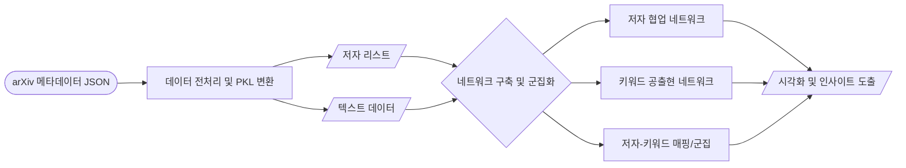

# ArXiv Network Analysis

이 프로젝트는 ArXiv 논문 데이터를 활용하여 논문 저자 간의 협업 관계와 주요 키워드의 동향을 네트워크 분석 기법으로 파악하는 포트폴리오 프로젝트입니다. 2007년부터 2023년까지 수집된 약 235만 건 이상의 논문 메타데이터를 기반으로 학술 연구의 거시적인 생태계와 트렌드를 조망합니다.

**사용 기술**: Python, NetworkX, igraph, scikit-learn (KMeans, PCA), Pandas, Matplotlib

---

## 1. Business Question
*"방대한 학술 논문 데이터 속에서 핵심 연구자와 융합 연구의 트렌드를 식별할 수 있을까?"*

단순한 논문 통계 분석을 넘어, 연구자 간의 실질적인 협력 관계와 주요 키워드 간의 연관성을 네트워크 구조로 파악하는 것을 목표로 합니다. 이를 통해 특정 분야(예: AI, 양자 기술)의 성장세와 분야 간 융합 양상을 정량적으로 도출하고자 합니다.

## 2. Data Overview
본 프로젝트는 [Kaggle의 Cornell University arXiv Dataset](https://www.kaggle.com/datasets/Cornell-University/arxiv/versions/152/data)을 활용합니다.

> *현재 해당 데이터셋 접근이 불가합니다.

- **데이터 수집**: Kaggle 제공 arXiv 메타데이터 (약 235만 건)
- **주요 활용 피처**:
  - `authors_parsed`: 저자 협업 네트워크 구축을 위한 공동 저자 정보
  - `title`, `abstract`: 키워드 공출현 네트워크 구축을 위한 텍스트 정보 (자연어 처리 적용)
  - `update_date`: 연도별 시계열 트렌드 분석을 위한 시간 연도 정보

## 3. Architecture

## 저장소 구성
| 경로 | 내용 |
| --- | --- |
| `src/data_processing/` | 원시 JSON 데이터를 PKL 포맷으로 전처리하는 스크립트 |
| `src/analysis/` | 공동 저자, 키워드 동시 등장 네트워크 분석 및 군집화 코드 |
| `data/raw/` | 다운로드 받은 원본 데이터 보관용 |
| `data/processed/` | 전처리 완료된 데이터 보관용 |
| `outputs/figures/` | 생성된 네트워크 시각화 결과물 (PNG 등) |
| `requirements.txt` | 프로젝트 실행에 필요한 패키지 목록 |

## 4. Tech Stack
1. **데이터 전처리 및 추출**:
   - 대용량 JSON 데이터에서 필요한 `authors`, `title`, `abstract` 필드만 추출하여 가벼운 PKL 형태로 변환합니다. 자연어 처리를 통해 불용어를 제거하고 주요 키워드를 정제했습니다.
2. **네트워크 구축 및 분석**:
   - `igraph` 및 `pycairo`를 활용하여 수백만 개의 엣지를 가진 대규모 네트워크를 시각화하고 Degree Centrality, Clustering Coefficient 등 네트워크 주요 지표를 연산했습니다.
3. **머신러닝 기반 군집화**:
   - 개별 연구자의 키워드 리스트를 벡터화한 후, `scikit-learn`의 KMeans 알고리즘을 적용하여 유사한 연구 주제를 공유하는 저자 집단을 군집화하고 PCA로 시각화했습니다.

## 시작하기 (Getting Started)

### 최소 권장 사양 및 환경
- Python: 3.8 이상
- 필수 라이브러리: [requirements.txt](requirements.txt) 참고 (`pip install -r requirements.txt`)

### 데이터 준비
1. Kaggle에서 `arxiv-metadata-oai-snapshot.json` 다운로드 후 `data/raw/`에 저장
2. `python src/data_processing/json_to_pkl.py` 실행

## 결과 요약
상세한 보고서는 [PROJECT_SUMMARY.md](PROJECT_SUMMARY.md)에서 확인할 수 있으며, 도출된 핵심 결과는 다음과 같습니다.

| 지표 / 항목 | 분석 결과 | 의미 |
| --- | --- | --- |
| 평균 클러스터링 계수 | 0.62 이상 | 학술 생태계 내 높은 밀도의 삼각형 협업 구조 및 깊은 주제 연관성 |
| 중심성 최상위 키워드 | study, learning, model, quantum | 해당 개념들이 다른 여러 연구 주제를 연결하는 핵심 허브 역할 수행 |
| 군집화 결과 | learning, graphene, quantum 결합 | 머신러닝과 물성 물리를 결합한 형태의 이종 분야 융합 연구 그룹 식별 |
| 트렌드 추이 | learning 관련 40% 이상 증가 (2021년 대비) | 딥러닝 등 모델/데이터 기반 연구 비중의 지속적이고 압도적인 성장세 |
